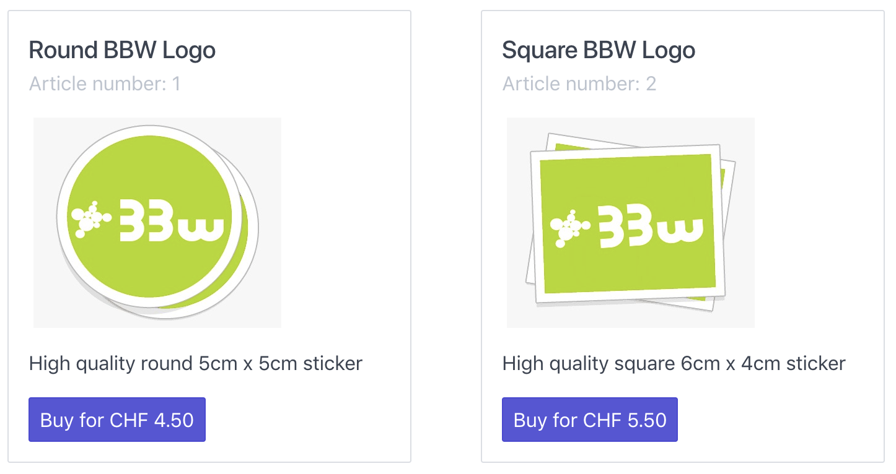

# BBW Stickershop Demo
A demo webshop to show a possible Datatrans integration.



##  Prerequisites
1. Java 11 installed on your local dev system
2. Maven installed on your local dev system
3. An IDE of your choice (preferably IntelliJ)
4. Some basic experience with [Spring Boot](https://spring.io/projects/spring-boot)
5. A [Datatrans merchantId](https://www.datatrans.ch/en/technics/test-account)
6. A Webhook (POST URL) listener configured in the [Datatrans Webmin Tool](https://admin.sandbox.datatrans.com).
As a default, this app exposes http://localhost:8080/payment/listener. Use a tool
like [ngrok](https://ngrok.com) to make this endpoint reachable from the internet.

## Run the demo webshop
1. Clone the repository
    ```zsh
    $ git clone git@github.com:datatrans/bbw-techtalk.git
    $ cd bbw-techtalk
    ```
2. Package & run the application
    ```
    $ mvn package
    $ java -jar -DdatatransUsername=<merchantId> -DdatatransPassword=<password> target/bbw-stickershop.jar
    ```
3. Open http://localhost:8080 with your favourite browser

## Deployment
[](https://heroku.com/deploy?template=https://github.com/datatrans/bbw-techtalk/tree/master)